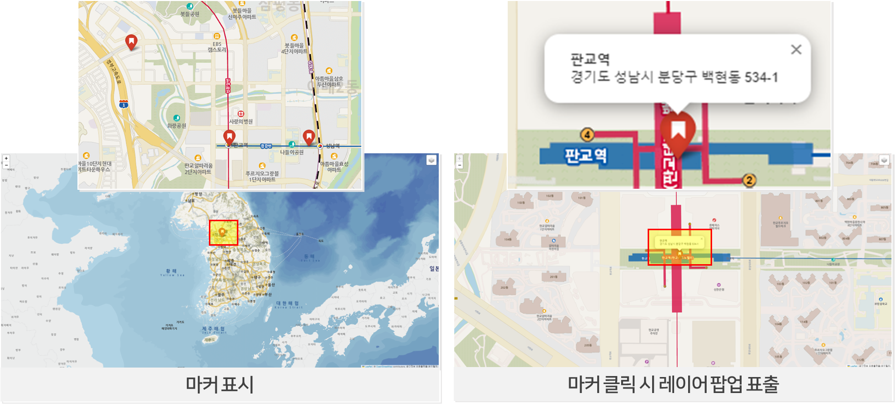

# 2024년 온라인 교육

🙌 브이월드 온라인 교육을 ~~~

## 목차
1. [파일 다운로드](#파일-다운로드)   
2. [2차시 교육](#2차시-교육)   
    2-1. [folium 불러오기](#folium-불러오기)   
    2-2. [브이월드 배경지도 불러오기](#브이월드-배경지도-불러오기)   
    2-3. [WMS(LX맵) 불러오기](#WMSLX맵-불러오기)   
    2-4. [레이어 컨트롤 기능 추가하기](#레이어-컨트롤-기능-추가하기)   
    2-5. [지오코딩 변수 선언](#지오코딩-변수-선언)   
    2-6. [지오코딩 실행](#지오코딩-실행)      
   
## 파일 다운로드
[📥 교육자료 다운로드](https://drive.usercontent.google.com/download?id=1Nu9fvBzGn4CKGFlAxc3yOyfABYf5HFDU&export=download&authuser=2)


## 2차시 교육
### folium 불러오기
```python
import folium

apikey='E5B1657B-9B6F-3A4B-91EF-98512BE931A1'
# 인증키는 언제든 삭제될 수 있으므로 인증키 발급 후 사용

map = folium.Map(
    location=[36.5, 127],
    zoom_start=7,
)
```
### 브이월드 배경지도 불러오기
```python
folium.TileLayer(
    tiles=f'https://api.vworld.kr/req/wmts/1.0.0/{apikey}/Base/{{z}}/{{y}}/{{x}}.png',
    attr='공간정보 오픈플랫폼(브이월드)',
    name='브이월드 배경지도',
).add_to(map)
```


### WMS(LX맵) 불러오기
```python
folium.WmsTileLayer(
    url='https://api.vworld.kr/req/wms?',
    layers='lt_c_landinfobasemap',
    request='GetMap',
    version='1.3.0',
    height=256,
    width=256,
    key=apikey,
    fmt='image/png',
    transparent=True,
    name='LX맵(편집지적도)',
).add_to(map)
```
### 레이어 컨트롤 기능 추가하기
```python
folium.LayerControl().add_to(map)
```
%20불러오기.png)

### 지오코딩 변수 선언
```python
address = [
    ['공간정보산업진흥원', '경기도 성남시 분당구 삼평동 624-3'],
    ['판교역', '경기도 성남시 분당구 백현동 534-1'],
    ['성남역', '경기도 성남시 분당구 백현동 545-1'],
]
```
### 지오코딩 실행
```python
import requests
apiurl = 'https://api.vworld.kr/req/address?'
for addr in address:
    params = {
        'service': 'address',
        'request': 'getcoord',
        'crs': 'epsg:4326',
        'address': addr[1],
        'format': 'json',
        'type': 'PARCEL',
        'key': apikey
    }
    response = requests.get(apiurl, params=params)
    if response.status_code == 200:
        data = response.json()

        print(data['response']['result']['point']) 
        x = data['response']['result']['point']['x']
        y = data['response']['result']['point']['y']

        folium.Marker([y, x],
            popup = folium.Popup(f'<b>{addr[0]}</b><br>{addr[1]}', max_width=200),
            icon = folium.Icon(color='red', icon='bookmark') 
            # 아이콘 색상 변경(red, blue 등) 및 아이콘 변경(home, star, flag, cloud, heart, bookmark 등)
        ).add_to(map) 
        # folium은 y x 순 입력 받는다.


map.save('map.html')
```

