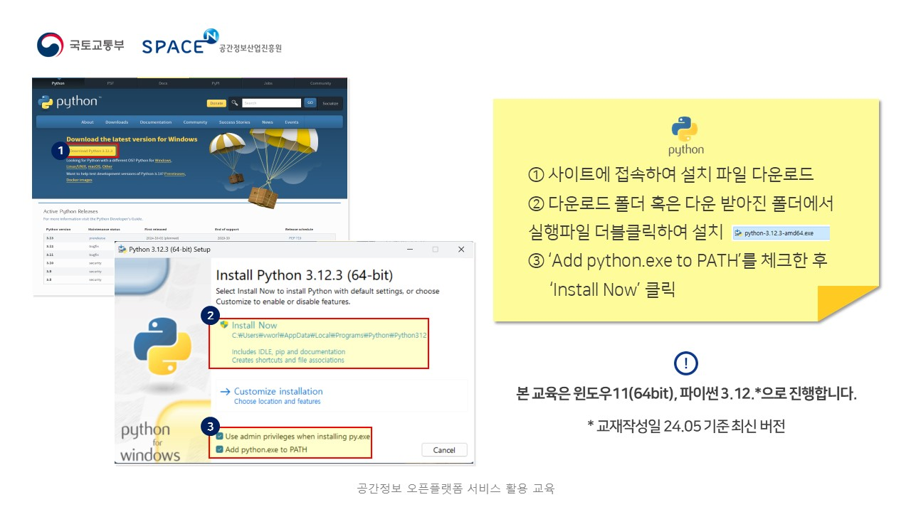

# 2024년 온라인 교육

🙌 교육 목표 : 브이월드 API를 활용하여 2D/3D 지도와 주제도를 표출함으로 국가공간정보 활용도를 높일 수 있다. 

## 목차
1. [교육자료 다운로드](#교육자료-다운로드)
2. [🔥 사전 준비(개발교육 시 필수)](#사전-준비) 
3. [✌️ 2차시 교육](#2차시-교육)   
    3-1. [folium 불러오기](#folium-불러오기)   
    3-2. [브이월드 배경지도 불러오기](#브이월드-배경지도-불러오기)   
    3-3. [WMS(LX맵) 불러오기](#wmslx맵-불러오기)   
    3-4. [레이어 컨트롤 기능 추가하기](#레이어-컨트롤-기능-추가하기)   
    3-5. [지오코딩 변수 선언](#지오코딩-변수-선언)   
    3-6. [지오코딩 실행](#지오코딩-실행)
4. [👌 3차시 교육](#3차시-교육)   
    4-1. [HTML 띄워보기](#html-띄워보기)   
    4-2. [3D지도 불러오기](#3d지도-불러오기)   
    4-3. [건물 및 주제도 레이어 불러오기](#건물-및-주제도-레이어-불러오기)   
    4-4. [주제도 레이어 속성 조회하기](#주제도-레이어-속성-조회하기)   
   
## 교육자료 다운로드
[📥 1. 공간정보 오픈플랫폼 활용 교육(1차)](https://drive.google.com/file/d/19DPz74HCNeHySTn4TwjxhAoI2O9TiHRV/view?usp=sharing)   
[📥 2. 공간정보 오픈플랫폼 개발 교육(1차~3)](https://drive.google.com/file/d/1LNv0JyoLYLzeIEYNM3da8jFp5nO5j72-/view?usp=sharing)   


## 사전 준비
[📥 1. Python 다운로드](https://www.python.org/downloads/)

- Python 설치


[📥 2. Visual Studio Code 다운로드](https://www.python.org/downloads/)

- Visual Studio Code 설치
.JPG)
.JPG)
.JPG)


## 2차시 교육
### folium 불러오기
```python
import folium

apikey='E5B1657B-9B6F-3A4B-91EF-98512BE931A1'
# 인증키는 언제든 삭제될 수 있으므로 인증키 발급 후 사용

map = folium.Map(
    location=[36.5, 127],
    zoom_start=7,
)
```
### 브이월드 배경지도 불러오기
```python
folium.TileLayer(
    tiles=f'https://api.vworld.kr/req/wmts/1.0.0/{apikey}/Base/{{z}}/{{y}}/{{x}}.png',
    attr='공간정보 오픈플랫폼(브이월드)',
    name='브이월드 배경지도',
).add_to(map)
```


### WMS(LX맵) 불러오기
```python
folium.WmsTileLayer(
    url='https://api.vworld.kr/req/wms?',
    layers='lt_c_landinfobasemap',
    request='GetMap',
    version='1.3.0',
    height=256,
    width=256,
    key=apikey,
    fmt='image/png',
    transparent=True,
    name='LX맵(편집지적도)',
).add_to(map)
```
### 레이어 컨트롤 기능 추가하기
```python
folium.LayerControl().add_to(map)
```
%20불러오기.png)

### 지오코딩 변수 선언
```python
address = [
    ['공간정보산업진흥원', '경기도 성남시 분당구 삼평동 624-3'],
    ['판교역', '경기도 성남시 분당구 백현동 534-1'],
    ['성남역', '경기도 성남시 분당구 백현동 545-1'],
]
```
### 지오코딩 실행
```python
import requests
apiurl = 'https://api.vworld.kr/req/address?'
for addr in address:
    params = {
        'service': 'address',
        'request': 'getcoord',
        'crs': 'epsg:4326',
        'address': addr[1],
        'format': 'json',
        'type': 'PARCEL',
        'key': apikey
    }
    response = requests.get(apiurl, params=params)
    if response.status_code == 200:
        data = response.json()

        print(data['response']['result']['point']) 
        x = data['response']['result']['point']['x']
        y = data['response']['result']['point']['y']

        folium.Marker([y, x],
            popup = folium.Popup(f'<b>{addr[0]}</b><br>{addr[1]}', max_width=200),
            icon = folium.Icon(color='red', icon='bookmark') 
            # 아이콘 색상 변경(red, blue 등) 및 아이콘 변경(home, star, flag, cloud, heart, bookmark 등)
        ).add_to(map) 
        # folium은 y x 순 입력 받는다.


map.save('map.html')
```


## 3차시 교육

### HTML 띄워보기

```html
<!DOCTYPE html>
<html>
    <head>
        <title>Title</title>
    </head>
    <body>
       Hello World!
    </body>
</html>
```


### 3D지도 불러오기

```html
<!DOCTYPE html>
<html>
    <head>
        <meta http-equiv="Content-Type" content="text/html; charset=UTF-8" />
        <title>VWorld WebGL 3D API 3.0 Sample</title>
        <script type="text/javascript" src="https://map.vworld.kr/js/webglMapInit.js.do?version=3.0&apiKey={apikey}"></script> 
    </head>
    <body>
        <div style="display: flex;">
            <!--맵 영역 지정-->
            <div style="float: left; width: 70%;">
                <div id="vmap" style="width: 100%; height: 700px;"></div>
            </div>
        </div>
        <script>
            // 지도 생성
            var map;	
            var options = {
            mapId : "vmap",// 지도맵 컨테이너 아이디
            initPosition : new vw.CameraPosition(
                new vw.CoordZ(126.92775802528264, 37.52501881993892, 12416),  
                new vw.Direction(0, -90, 0)
                ), // 초기 위치
            logo: false,	 // 하단 로고 설정. true : 표출, false : 미표출
            navigation: true // 오른쪽 상단 네비게이션 설정. true : 표출, false : 미표출
            };
        
            map = new vw.Map();   
            map.setOption(options);
            map.setMapId("vmap");
            map.setInitPosition(new vw.CameraPosition(
                new vw.CoordZ(126.92775802528264, 37.52501881993892, 12416),  
                new vw.Direction(0, -90, 0)
            ));
            
            // 로고 및 네비 설정.
            map.setLogoVisible(true);
            map.setNavigationZoomVisible(false);
            map.start(); // 지도 생성
        </script>
    </body>
</html>
```


### 건물 및 주제도 레이어 불러오기
- head
```html
<style type="text/css">
    table{
        border-collapse: separate;
        border-spacing: 0;
        text-align: left;
        line-height: 1.5;
        border-top: 1px solid #ccc;
        border-left: 1px solid #ccc;
        margin: 20px 10px;
    }
    table th{
        width: 150px;
        padding: 10px;
        font-weight: bold;
        vertical-align: top;
        border-right: 1px solid #ccc;
        border-bottom: 1px solid #ccc;
        border-top: 1px solid #fff;
        border-left: 1px solid #fff;
        background: #eee;
    }
    table td{
        padding: 10px;
        vertical-align: top;
        border-right: 1px solid #ccc;
        border-bottom: 1px solid #ccc;
    }
</style>
```
- html
```html
<div style="float: left; width: 40%;">
    <header>
        <table id="wlayerList">
            <tr>
                <th>건물 레이어 On/Off</th>
                <td><input type="checkbox" onclick="checkLayer(this, 'facility_build')" checked="checked"></td>
            </tr>
            <tr>
                <th>WMS LX맵(편집지적도) 레이어</th> 
                <td><input type="button" value="WMS/WFS 조회" onclick="wmsSample();"/></td>
            </tr>
        </table>
    </header>
</div>
```

- 건물 ON/OFF js
```javascript
var checkLayer = function(c,name){ //레이어 제어
    if($(c).is(":checked")==false) {
        map.getLayerElement(name).hide() //레이어 숨김
    } else {
        map.getLayerElement(name).show() // 레이어 보여주기
    }
}
```


- 주제도(LX맵) 레이어 표출 js
```javascript
// LX맵(연속지적도) WMS
var chk = 0;

function wmsSample() {
    var wmsLayer = new vw.Layers();
    wmsSource = new vw.source.TileWMS();
    wmsSource.setUrl("https://api.vworld.kr/req/wms?Key={key}&");
    wmsSource.setParams("tilesize=256");
    wmsSource.setLayers("lt_c_landinfobasemap");
    wmsSource.setStyles("lt_c_landinfobasemap");
    wmsSource.setFormat("image/png");
    var wmsTile = new vw.layer.Tile(wmsSource);
    wmsLayer.add(wmsTile);
    
    chk = 1;

    map.onClick.addEventListener(wfsEvent);
}
```


### 주제도 레이어 속성 조회하기
- html
```html
<div style="height: 700px; padding: 20px;">
    <form id="wfsForm">
        <input type="hidden" name="key" value="CBDA8338-FEF2-34AE-9B04-D31B3597153F">
        <input type="hidden" name="SERVICE" value="WFS">
        <input type="hidden" name="version" value="1.1.0">
        <input type="hidden" name="request" value="GetFeature">
        <input type="hidden" name="TYPENAME" value="lt_c_landinfobasemap">
        <input type="hidden" name="OUTPUT" value="text/javascript">
        <input type="hidden" name="SRSNAME" value="EPSG:4326">
        <input type="hidden" name="BBOX" value="">
    </form>
    <div>
        <span><b>* 선택한 LX맵(편집지적도) WFS *</b></span><div><ul id="resultDiv"></ul></div>
    </div>
</div>
```

- js
```javascript
//대략적인 마우스 클릭 크기에 맞는 BBOX 영역 계산
var getBuffer = function(x,y){
    position = map.getCurrentPosition().position
    var z = position.z

    //111,000KM  1도 단위
    var m = 1/(111000/z*1.48*50);
    var h = 1/(111000/z*1.85*50);

    return [m,h];
}

// LX맵(연속지적도) WFS
var wfsEvent = function(windowPosition, ecefPosition, cartographic, featureInfo, event) {
    var mh = getBuffer(cartographic.longitudeDD,cartographic.latitudeDD);

    let min = [cartographic.longitudeDD-mh[0],cartographic.latitudeDD-mh[1]]
    let max = [cartographic.longitudeDD+mh[0],cartographic.latitudeDD+mh[1]]
    let box = min[0]+","+min[1]+","+max[0]+","+max[1]

    $('#wfsForm > [name=BBOX]').val(box);	
    
    $.ajax({
        type: "get",
        url: "https://api.vworld.kr/req/wfs",
        data : $('#wfsForm').serialize(),
        dataType: 'jsonp',
        async: false,
        jsonpCallback:"parseResponse",
        success: function(data) {
            var resultHtml = "";
            if(data.totalFeatures == 0){
                alert("검색결과가 없습니다.");
            }else{
                if(chk != 0){
                    var data = data.features[0].properties;
                    console.log(data);
                    let resultHtml="";
                    resultHtml+="<li> - 필지번호(pnu) : "+data.pnu+"</li>";
                    resultHtml+="<li> - 시도명(sido_nm) : "+data.sido_nm+"</li>";
                    resultHtml+="<li> - 시군구명(sgg_nm) : "+data.sgg_nm+"</li>";
                    resultHtml+="<li> - 읍면동명(emd_nm) : "+data.emd_nm+"</li>";
                    resultHtml+="<li> - 리명(ri_nm) : "+data.ri_nm+"</li>";
                    resultHtml+="<li> - 지번(jibun) : "+data.jibun+"</li>";
                    resultHtml+="<li> - 지목(jimok) : "+data.jimok+"</li>";
                    resultHtml+="<li> - 소유지명(owner_nm) : "+data.owner_nm+"</li>";

                    $('#resultDiv').html(resultHtml);
                }
                
            }//else 종료
        },
        
        error: function(xhr, stat, err) {}
    });
}
```

