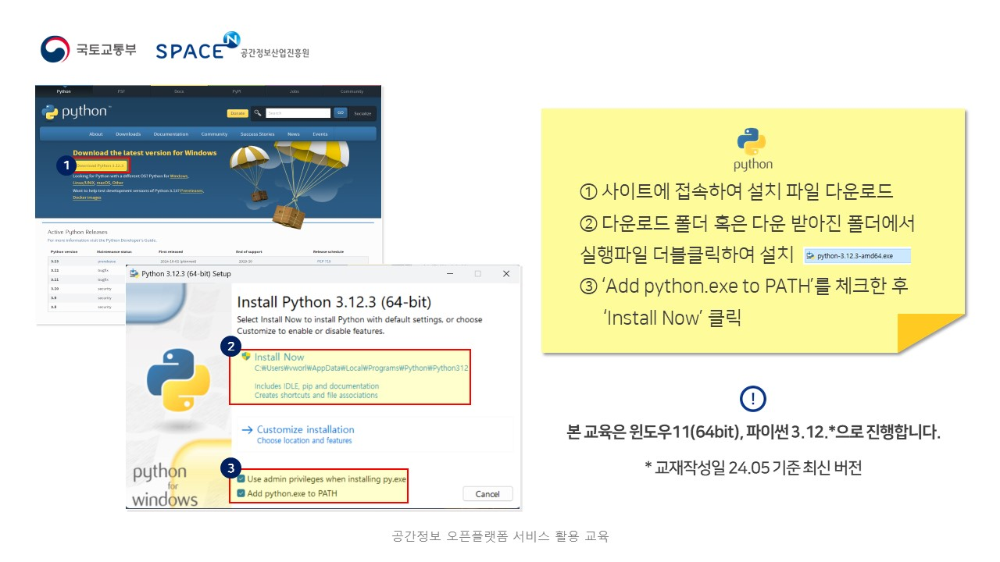

# 2025년 10월 23~24일 울산기술공업고등학교 교육

🙌 교육 목표 :

- (활용기초) 공간정보와 브이월드의 개념을 알고 서비스 기능을 활용할 수 있다.
- (시각화실습) 브이월드 데이터를 활용하여 공간정보를 시각화하고 분석할 수 있다.
- (개발실습) 브이월드 API를 활용하여 2D/3D 지도와 주제도를 표출할 수 있다.

## 교육자료 다운로드

[📥 1. 공간정보 오픈플랫폼 활용 교육](https://drive.google.com/file/d/1t9CSjI5LIheG2iEVwSHPr0_SW2e0nrfU/view?usp=drive_link) 
[📥 브이월드 활용 가이드북(하이라이트)](https://drive.google.com/file/d/1QyfZe4w1F_2jTrZahCmDbL2MWQ71bisT/view?usp=drive_link) 
[📥 브이월드 활용 가이드북](https://drive.google.com/file/d/1-zpUVH5NmG_3doAR9zR75waDBKb1Q3Go/view?usp=drive_link) 
[📥 공간정보 오픈플랫폼 DT3차 고도화](https://drive.google.com/file/d/1iZeS1IYReb1EoS9eSOMdgcsd7wGK0qhL/view?usp=drive_link)  
[📥 2. 공간정보 오픈플랫폼 시각화 교육](https://drive.google.com/file/d/1h4JwYaSmWA1dmaYAhoNKfEvDEybQ8d5Z/view?usp=drive_link)  
[📥 3-1. 공간정보 오픈플랫폼 개발 교육](https://drive.google.com/file/d/1NtOagaSVYszPYeOMqDn-KZ2bs42s32qF/view?usp=drive_link) 
[📥 3-2. 공간정보 오픈플랫폼 개발 교육](https://drive.google.com/file/d/1irfLJdG_v3SuDF70OAFrFP6TK9y1Oo-c/view?usp=drive_link) 
[📥 3-3. 공간정보 오픈플랫폼 개발 교육](https://drive.google.com/file/d/1mnf-eb7jWBNTmezRFdVUZyjlFDMOBIBn/view?usp=drive_link) 
[📥 3-4. 공간정보 오픈플랫폼 개발 교육](https://drive.google.com/file/d/1nRwhSv93MAYiBQP-fBUpyJbtV9sz6M5W/view?usp=drive_link) 
 

## 사전 준비

- 깃허브 제한사항으로 해당 링크 클릭 시 새 창으로 열리지 않기 때문에 "링크를 마우스 우클릭" 하여 열기 권장합니다.
 

[📥 1. QGIS 다운로드(분석교육, 개발교육)](https://www.qgis.org/download/)

- QGIS 설치
.png)
.png)
.png)

[📥 2. Python 다운로드(개발교육)](https://www.python.org/downloads/)

- Python 설치

[📥 3. Visual Studio Code 다운로드(개발교육)](https://code.visualstudio.com/)

- Visual Studio Code 설치
.JPG)
.JPG)
.JPG)
